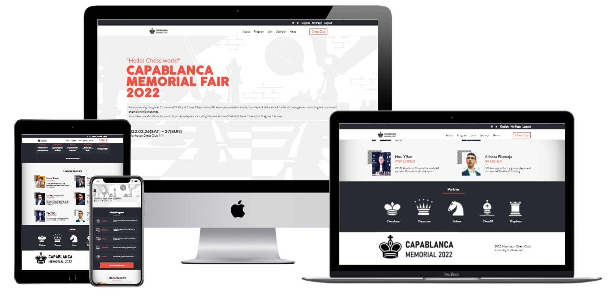

# Capstone project

> Site for a Chess event in the Memorial of one of the greatest chess players in history. Build with CSS, HTML & JS 

[Live demo](https://vicperalta.github.io/ChessEvent/)

## Built With

- HTML
- CSS
- Javascript

## Authors

👤 **Victor Peralta**

- GitHub: [@VicPeralta](https://github.com/VicPeralta)
- Twitter: [@VicPeralta](https://twitter.com/VicPeralta)

## Credits
[Original design idea by Cindy Shin in Behance](https://www.behance.net/gallery/29845175/CC-Global-Summit-2015)

## Show your support

Give a ⭐️ if you like this project!

## 📝 License

This project is [MIT](./MIT.md) licensed.